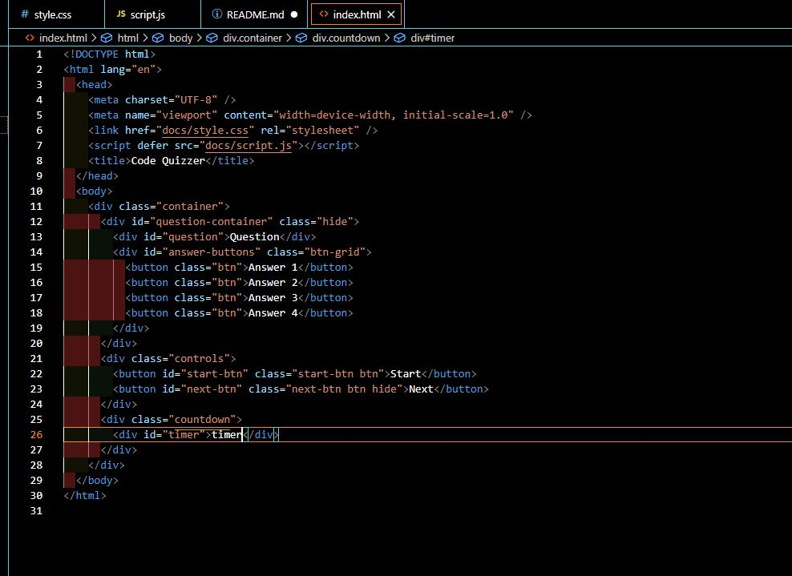
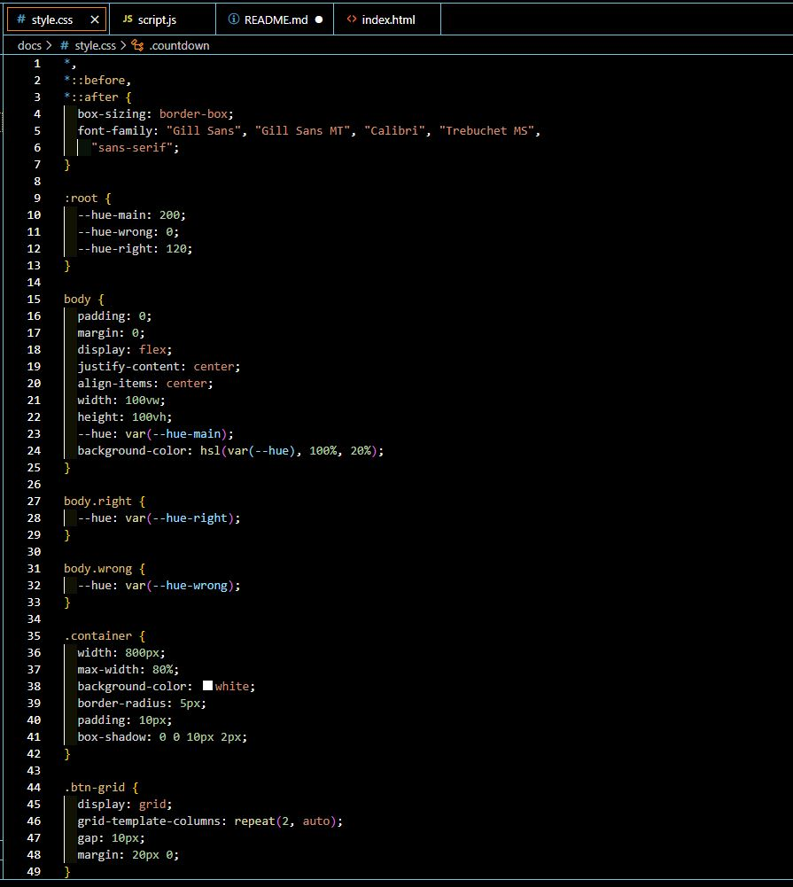
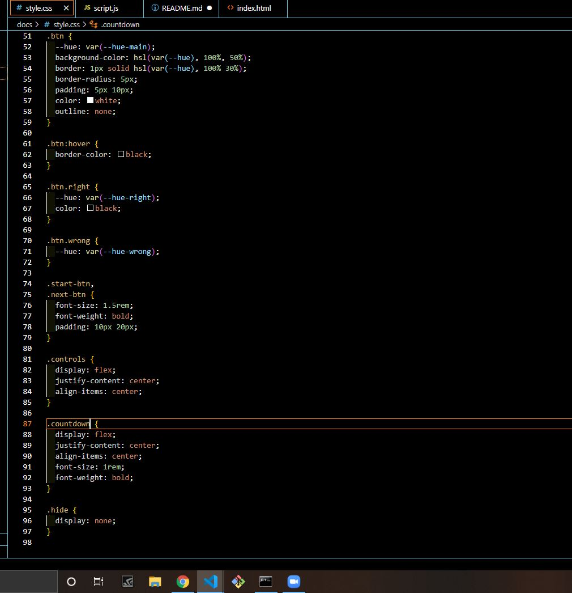
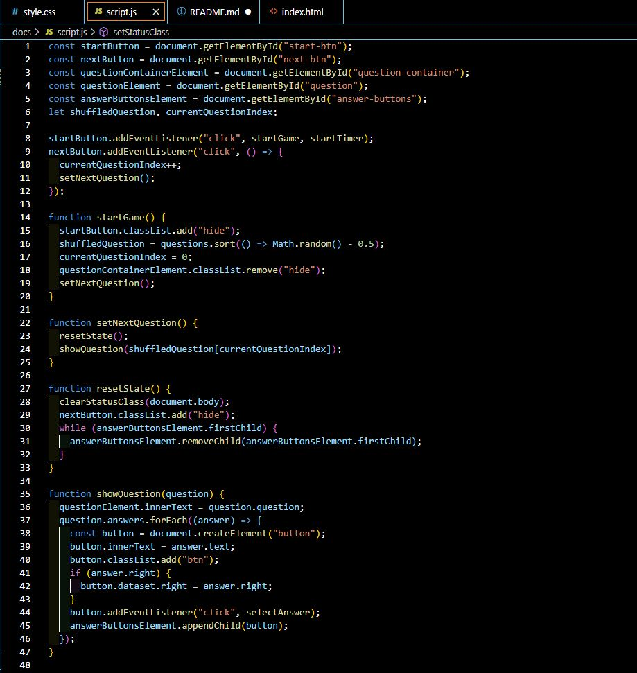
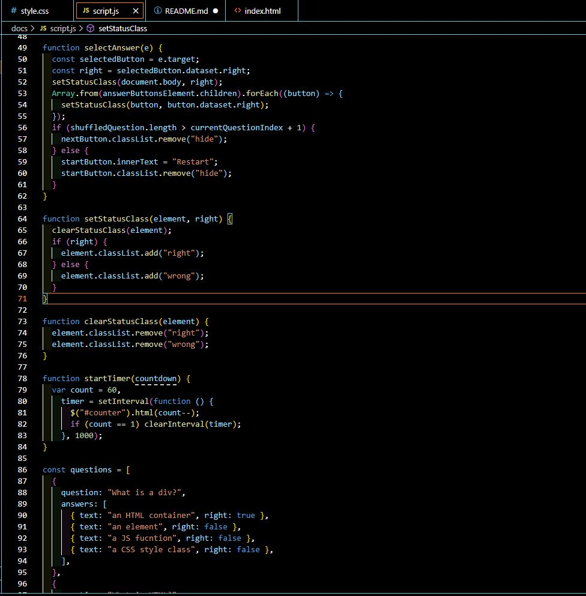
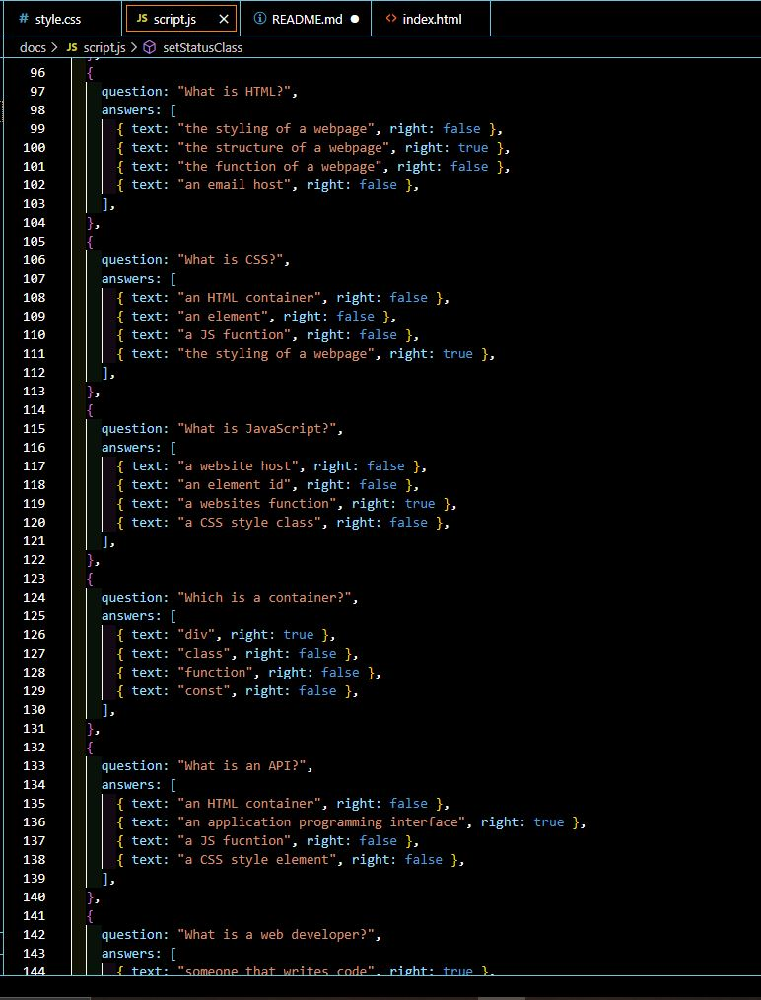

# CodeQuizzer

## Please Note that I have NOT completed this assignment at this time, I simply ran out of time.

### The assignment was to make a functional quiz with a score keeper, timer, and high score form. I have a mostly functional quiz but was not able to finish the requirements in the time frame. 

### Here are screenshots of my working project along with links to the repo and deployed page.

[Github](https://github.com/JuStrait/CodeQuizzer)
[Live Page](https://justrait.github.io/CodeQuizzer/)

